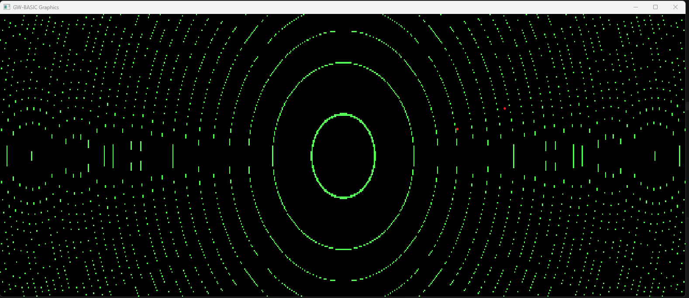
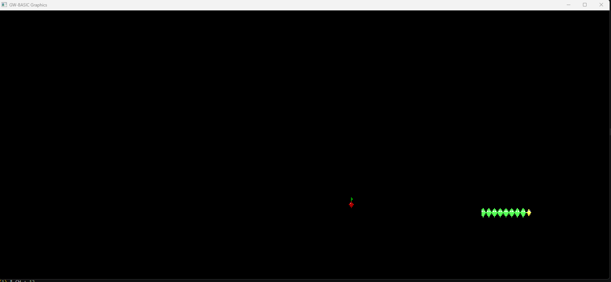
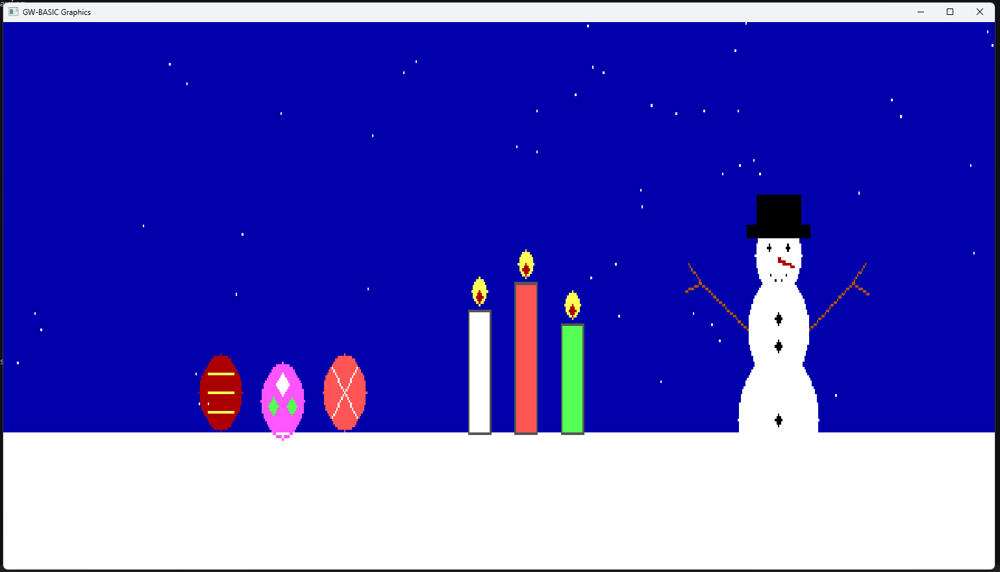
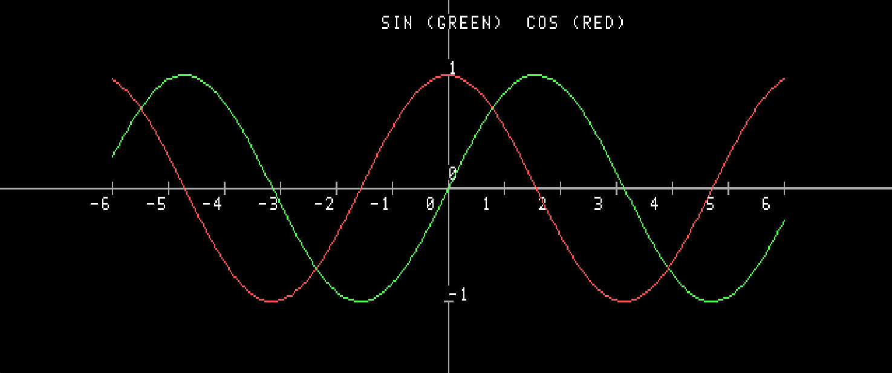
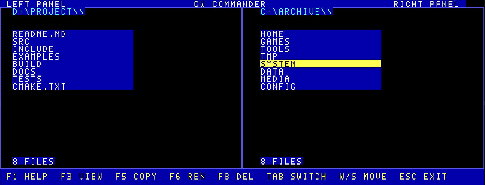

# GW-BASIC (Modern Cross-Platform Rewrite)

A modern, cross-platform rewrite of the classic **GW-BASIC interpreter**, implemented in **C++20** with a real-time execution model and hardware-accelerated graphics.

This project aims to preserve the simplicity and spirit of GW-BASIC while providing a clean, extensible architecture suitable for modern systems.

---

## ✨ Features

### 🧠 Language Support

* Line-numbered BASIC programs
* Immediate mode (REPL) + file execution
* Control flow:

  * `IF ... THEN ... ELSE`
  * `GOTO`, `GOSUB`, `RETURN`
  * `FOR/NEXT`
  * `WHILE/WEND`
* Variables:

  * Numeric + string
  * Arrays (`DIM`, `ERASE`, `OPTION BASE`)
  * Default typing (`DEFINT`, `DEFSTR`, etc.)
* Expressions:

  * Arithmetic
  * Exponentiation (`^`)
  * Integer division (`\`) and `MOD`
  * Logical (`AND`, `OR`, `NOT`)
  * User-defined `DEF FN` functions
* Functions:

  * `ABS`, `INT`, `LEN`, `VAL`
  * `FIX`, `CINT`, `CLNG`, `CSNG`, `CDBL`, `SGN`, `SQR`, `SIN`, `COS`, `TAN`, `ATN`, `EXP`, `LOG`
  * `RND`
  * `DATE$`, `TIME$`, `TIMER`
  * String functions (`LEFT$`, `RIGHT$`, `MID$`, `UCASE$`, `LCASE$`, etc.)

---

### 🎮 Real-Time Engine

* Frame-based execution model
* Non-blocking input (`INKEY$`)
* Engine tick integration
* Batch rendering for high-performance drawing
* Suitable for games and simulations

---

### 🖥 Graphics

#### Rendering Backends

* **Windows** → Direct3D 11
* **Linux** → OpenGL (X11)
* **Headless** mode for testing / CI

#### Graphics API

* `SCREEN`
* `CLS`
* `COLOR`
* `LOCATE`
* `PSET`, `LINE`, `CIRCLE`
* `PAINT`, `DRAW`
* `GET` / `PUT` (graphics blocks)
* `VIEW`, `WINDOW`, `PMAP`
* `PALETTE`, `PALETTE USING`

#### Features

* Pixel canvas abstraction
* Palette remapping
* Viewport and world-coordinate transforms
* Hardware-accelerated presentation
* Aspect-preserving window scaling
* Automatic batching for performance

#### Examples 

 Here is example of graphics 

 
  `tan(x^2 + y^2) = 1` graph example:

 


  `snake game` example:

 


 `easter card` example:

 

 
 `y=sin(x), y=cos(x)` graphs:

 


 `norton commaner` inspired example:

 

---

### 📁 File I/O

* `OPEN`, `CLOSE`
* `INPUT#`, `PRINT#`, `WRITE#`
* `LINE INPUT#`
* `EOF`, `LOF`, `LOC`
* `KILL`, `NAME`, `MKDIR`, `RMDIR`

---

### 🎹 Input

* `INKEY$` (non-blocking)
* Keyboard input from:

  * Console
  * Native graphics window (Win32 / X11)

---

## 🚀 Getting Started

### Build

#### Requirements

* C++20 compiler
* CMake ≥ 3.16

#### Linux

```bash
cmake --preset debug
cmake --build --preset debug
ctest --preset debug
```

#### Windows (MSVC)

```powershell
cmake --preset debug
cmake --build --preset debug --config Debug
ctest --preset debug -C Debug
```

---

## ▶️ Usage

### Run interpreter (REPL)

```bash
gwbasic
```

### Run BASIC file

```bash
gwbasic --file ./examples/snake.bas
```

### Console editor

```bash
gwbasic --edit ./examples/snake.bas
```

The editor accepts numbered BASIC lines directly and supports commands such as
`RUN`, `CHECK`, `LIST`, `OPEN <file>`, `SAVE [file]`, `EDIT <line>`,
`DEL <line>`, `RENUM`, `NEW`, and `QUIT`.

### Headless mode (no graphics window)

```bash
gwbasic --headless --file ./examples/snake.bas
```

### Syntax check without running

```bash
gwbasic --check --file ./examples/snake.bas
```

Inside the REPL or a BASIC program, text source can be persisted with:

```basic
SAVE "program.bas"
LOAD "program.bas"
```

---

## 🧪 Example

### Snake Game

```bash
gwbasic --file ./examples/snake.bas
```

Features:

* real-time gameplay
* keyboard control via graphics window
* hardware-accelerated rendering

More examples are listed in [examples/README.md](./examples/README.md).

---

### Math Plot

```basic
10 SCREEN 2
20 CLS
30 COLOR 15,0
40 CX = 320: CY = 100
50 SX = 0.03: SY = 0.03
60 FOR PY = 0 TO 199
70 FOR PX = 0 TO 639
80 X = (PX - CX) * SX
90 Y = (PY - CY) * SY
100 IF ABS(TAN(X*X+Y*Y)-1) < 0.05 THEN PSET (PX,PY), 10
110 NEXT PX
120 NEXT PY
130 END
```

---

## 📚 Compatibility

See [docs/compatibility.md](./docs/compatibility.md) for the current supported
GW-BASIC statements/functions, known differences, and test coverage.

### API Documentation

If Doxygen is installed, generate developer API docs with:

```bash
cmake --preset docs
cmake --build --preset docs
```

---

## 🏗 Architecture

### Core Components

#### Interpreter

* Lexer → Parser → AST → Execution
* Line-numbered program storage
* Immediate + stored execution modes

#### Runtime

* Variable storage
* Array memory
* File handles
* Graphics state
* Engine tick integration

#### Graphics

* In-memory pixel canvas
* Platform-specific presenter:

  * D3D11 (Windows)
  * OpenGL (Linux)
* Batch rendering system

#### Engine Loop

* Cooperative execution
* Frame pacing (~60 FPS)
* Event pumping
* Input polling

---

## ⚡ Performance Notes

* Rendering is **batched**, not per-pixel immediate
* Large plots are now significantly faster than naive implementations
* Still an interpreter → heavy numeric loops can be slow
* Prefer:

  * coarse stepping
  * analytical drawing (e.g., circles instead of brute-force)

---

## ⚠️ Limitations

* Not a 100% GW-BASIC clone
* Graphics are **portable abstractions**, not exact hardware emulation
* Some legacy quirks are not implemented
* Floating-point math is modernized (not 8087-compatible)
* Performance depends on interpreter speed

---

## 🛠 Roadmap

* Fixed-timestep VM scheduler
* More BASIC compatibility edge cases
* Improved parser tolerance
* Sound subsystem (`PLAY`, `SOUND`) improvements
* Better console emulation
* Optional SDL backend
* Debug / trace mode

---

## 🤝 Contributing

Contributions are welcome.

Focus areas:

* language compatibility
* performance improvements
* platform backends
* test coverage

---

## 📜 License

Under MIT license

---

## 🎯 Vision

This project is not just a clone.

It’s a **modern BASIC runtime**:

* simple like the original
* powerful enough for real-time programs
* portable across platforms
* clean and extensible in design
